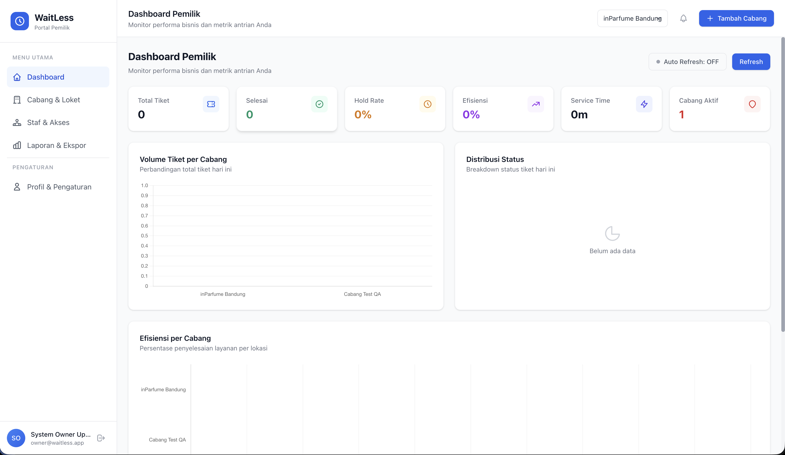
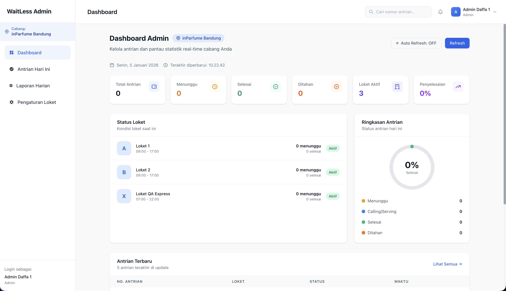
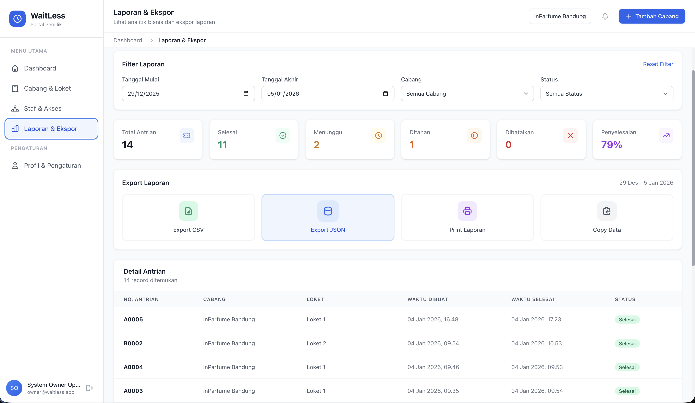
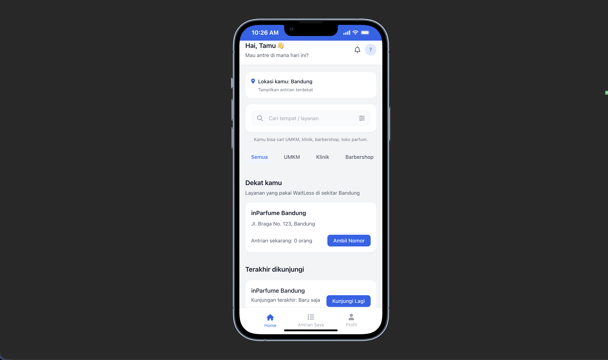

# Dokumentasi Teknis dan Panduan Pengguna - Aplikasi Waitless

**Tugas Kelompok 5 - Rekayasa Perangkat Lunak (Semester 3)**

---

## 📌 Informasi Proyek

Waitless adalah sistem manajemen antrean modern berbasis web yang dirancang untuk meningkatkan efisiensi operasional bisnis layanan publik. Aplikasi ini memungkinkan pengguna untuk memantau antrean secara _real-time_, melakukan pemesanan tiket antrean secara mandiri, dan memungkinkan pemilik layanan untuk mengelola loket dan analitik kinerja secara terpusat.

**Repositori:** Waitless-Project  
**Status Pengembangan:** Production Ready  
**Deployment:** Vercel Serverless Function

---

## 👥 Tim Pengembang (Kelompok 5)

Berikut adalah anggota tim yang bertanggung jawab dalam pengembangan aplikasi Waitless:

| Nama Lengkap              | NIM         | Peran Utama                  |
| :------------------------ | :---------- | :--------------------------- |
| **Muhammad Daffa Fauzan** | 24552011140 | Fullstack Developer & DevOps |
| **Harfin Taufiq**         | 24552011171 | Backend Developer            |
| **Salman Sopandi**        | 24552011383 | Frontend Developer           |
| **Hifzhan Manna Maula**   | 25552012002 | UI/UX Designer & QA          |

---

## 🌐 Akses Aplikasi (Production)

Aplikasi telah berhasil dideploy dan dapat diakses secara publik melalui tautan berikut:

👉 **[https://waitless-iota.vercel.app](https://waitless-iota.vercel.app)**

> **Catatan:** Pastikan untuk mengakses menggunakan perangkat desktop untuk pengalaman Dashboard Admin/Owner yang optimal, dan perangkat mobile untuk pengalaman Pengunjung (Visitor).

---

## 🏗️ Arsitektur Teknologi

Sistem ini dikembangkan menggunakan pendekatan **Monolith Modern** yang dioptimalkan untuk lingkungan _Serverless_ (Vercel), dengan spesifikasi teknologi sebagai berikut:

- **Frontend Framework:** Nuxt 3 (Vue.js + TypeScript)
- **Backend Server:** Express.js (diintegrasikan via Nitro Server Engine)
- **Database ORM:** Sequelize
- **Database Driver:** MySQL2 (Production) / SQLite (Development)
- **State Management:** Pinia
- **UI Framework:** Tailwind CSS
- **Authentication:** JWT (JSON Web Token) + Google OAuth
- **Deployment Platform:** Vercel

---

### 3. Struktur Halaman & Routing

Berikut adalah peta situs (sitemap) berdasarkan hak akses pengguna:

#### 🟢 Visitor (Pengunjung / Publik)

- `/` - Halaman Utama (Cari Outlet & Layanan)
- `/welcome` - Halaman Sambutan & Informasi
- `/login` - Masuk & Pendaftaran Akun (Unified)
- `/queue/:id` - Halaman Pengambilan Tiket
- `/queue/me` - Halaman Monitoring Antrean Saya
- `/profile` - Pengaturan Profil Pengunjung

#### 🔵 Owner (Pemilik Usaha)

- `/owner/login` - Portal Login Owner
- `/owner/dashboard` - Dashboard Statistik Global
- `/owner/branches` - Manajemen Cabang & Outlet
- `/owner/staff` - Manajemen Akun Staf & Hak Akses
- `/owner/reports` - Laporan & Analitik Bisnis
- `/owner/profile` - Pengaturan Akun Owner

#### 🔴 Admin (Staf Loket)

- `/admin/login` - Portal Login Staf/Admin
- `/admin/dashboard` - Dashboard Operasional (Pilih Cabang)
- `/admin/queue` - Kontrol Antrean (Panggil/Layani/Selesai)
- `/admin/settings` - Konfigurasi & Status Loket
- `/admin/reports` - Ringkasan Laporan Harian
- `/admin/profile` - Pengaturan Akun Staf

---

## 📖 Panduan Penggunaan (User Guide)

### 1. Peran Pengguna (User Roles)

Sistem membedakan hak akses menjadi tiga tingkat:

1.  **Visitor (Pengunjung):** Mengambil tiket, memilih layanan, memantau antrean.
2.  **Owner (Pemilik):** Mengelola cabang/lokasi, membuat akun staf, melihat laporan analitik.
3.  **Admin/Member (Staf):** Menjalankan operasional loket (memanggil, melayani, menyelesaikan antrean).

### 2. Fitur Utama

#### A. Dashboard Owner (Analitik & Manajemen)

Pusat kendali bagi pemilik usaha untuk memantau performa seluruh cabang.

- **Statistik Real-time:** Menampilkan total kunjungan, efisiensi layanan, dan status loket aktif.
- **Manajemen Cabang:** Menambah dan mengatur lokasi layanan.
- **Manajemen Staf:** Mengundang dan mengatur akses staf ke cabang tertentu.


_(Gambar: Tampilan Dashboard Owner dengan grafik analitik)_

#### B. Dashboard Admin (Operasional Loket)

Antarmuka kerja bagi staf loket untuk memproses antrean.

- **Kontrol Antrean:** Tombol _Call Next_, _Recall_, _Hold_, dan _Done_.
- **Status Loket:** Membuka dan menutup loket.
- **Daftar Tunggu:** Melihat sisa antrean yang sedang berjalan.


_(Gambar: Tampilan Dashboard Admin untuk memanggil antrean)_

#### C. Laporan & Rekapitulasi

Fitur pelaporan otomatis untuk evaluasi kinerja.

- **Top Performer:** Peringkat cabang dengan performa terbaik.
- **Riwayat Kunjungan:** Data historis jumlah pengunjung per periode.



#### D. Halaman Pengunjung (Visitor)

Antarmuka _mobile-first_ bagi pelanggan.

- **Ambil Antrean:** Memilih layanan dan mendapatkan nomor antrean digital.
- **Estimasi Waktu:** Melihat perkiraan waktu tunggu dan jumlah orang di depan.



---

## 🧪 Akun Testing (Production)

Untuk mempermudah pengujian aplikasi di lingkungan production, gunakan kredensial berikut:

### 🟢 Visitor (Pengunjung)

- **Email:** `testing@gmail.com`
- **Password:** `Test123*`
- _Tips: Gunakan login **Google OAuth2** untuk akses lebih cepat dan aman._

### 🔵 Owner (Pemilik Usaha)

- **Email:** `owner@waitless.app`
- **Password:** `password123`

### 🔴 Admin (Staf Loket)

- **Akun 1:**
  - Email: `admin1@waitless.app`
  - Password: `admin123`
- **Akun 2:**
  - Email: `admin2@waitless.app`
  - Password: `admin123`

---

## ⚙️ Panduan Instalasi (Development)

Untuk menjalankan aplikasi ini di lingkungan lokal (Localhost), ikuti langkah-langkah berikut:

### Prasyarat

- Node.js (v18 atau lebih baru)
- NPM (Node Package Manager)

### Langkah Instalasi

1.  **Clone Repositori**

    ```bash
    git clone <repository-url>
    cd Waitless-Project
    ```

2.  **Instalasi Dependensi**

    ```bash
    npm install
    ```

3.  **Konfigurasi Environment**
    Buat file `.env` berdasarkan template `.env.example`.

    > ⚠️ **PENTING:** Jangan pernah men-commit file `.env` asli ke dalam repositori publik untuk menjaga keamanan kredensial database.

4.  **Menjalankan Server Development**
    ```bash
    npm run dev
    ```
    Aplikasi akan berjalan di `http://localhost:3000`.

---

## 🛡️ Catatan Keamanan & Privasi

1.  **Environment Variables:** Kredensial sensitif seperti API Key dan Database Password disimpan aman di server Vercel dan tidak disertakan dalam kode sumber (repository).
2.  **Autentikasi:** Seluruh akses ke halaman Admin/Owner dilindungi oleh middleware autentikasi berbasis JWT.
3.  **Validasi Input:** Seluruh input dari pengguna divalidasi di sisi server untuk mencegah serangan injeksi data.

---

**Dibuat oleh Kelompok 5**
_Teknik Informatika - Universitas Teknologi Bandung_
